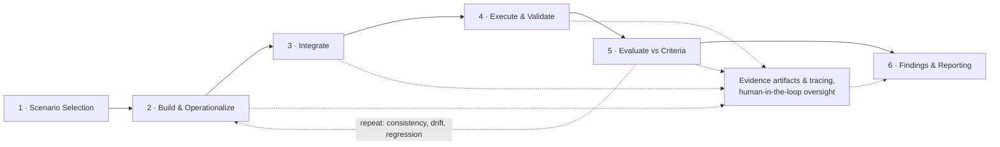

# GenAI Alignment

<div align="center">

**Scenario-based alignment testing for enterprise GenAI systems — copilots, RAG assistants, and agentic workflows**

[](https://www.python.org/downloads/)
[](LICENSE)
[]()
[](.env.example)
[](.env.example)

*Foundational behavior · boundaries & robustness · agentic & enterprise controls*

</div>

---

<a id="overview"></a>

## 🧭 Overview

Most GenAI evaluation work answers one of two questions: *"how capable is this model?"* or *"can it be attacked?"*. **GenAI Alignment** asks a third, distinct question — one that matters most once a system is actually deployed inside an enterprise:

> **Does this GenAI system keep doing what it was authorized to do — correctly, consistently, within its granted scope, and safely as it scales into agentic and multi-agent use — as inputs, versions, and time change?**

That is an *alignment* question, not a capability or attack question. It sits closer to model-risk governance than to a leaderboard: the deliverable of this repo is not "which model scored highest," but **evidence-backed findings and audit-ready control requirements** for a specific deployed system, mapped to a defined scenario library.

**This repo does not reimplement evaluation machinery that already exists.** It is a thin scenario-taxonomy, adapter, and reporting layer over a small ecosystem of sibling repos that already do the deep work — see [Where This Fits](#where-this-fits). New work here is concentrated where a real gap exists: objective-drift, boundary/permission, drift-detection, fail-safe, autonomy/oversight-gating, and third-party/vendor-agent testing (see [Scenario Library](#scenario-library)).

<a id="contents"></a>

## 📌 Contents

- [Overview](#overview)
- [Setup](#setup)
- [Where This Fits](#where-this-fits)
- [Scenario Library](#scenario-library)
- [Target Systems](#target-systems)
- [Testing Strategy](#testing-strategy)
- [Capabilities](#capabilities)
- [Repository Structure (planned)](#repository-structure-planned)
- [Status & Roadmap](#status--roadmap)

---

<a id="setup"></a>

## ⚙️ Setup

Each scenario notebook depends on this repo's adapters *and* the sibling repo they call into (e.g. `genai_capability_bench`). Neither installs itself — install both into whichever Python environment your Jupyter kernel actually uses, then select that kernel in the notebook:

```bash
pip install -e .
cp .env.example .env   # then fill in your Azure OpenAI values
```

`pip install -e .` pulls in `genai_capability_bench` automatically (it's declared in `pyproject.toml`) — but only into the environment you ran the command in. If you use a named conda kernel (e.g. `adv_env`), run this with that environment's `pip`, not your system one, and confirm the notebook's kernel selector matches it before running.

Scenario fixtures that sample a public benchmark (e.g. `scenarios/fixtures/public_benchmark_sample.jsonl`) are **frozen snapshots committed to this repo** — running the notebooks needs nothing beyond the `pip install` above. Regenerating a sample from scratch is the only time you'd need a local sibling clone of the source repo (its dataset files aren't part of the pip package); see that fixture's `_manifest.json` for the exact commit and sampling parameters used.

<a id="where-this-fits"></a>

## 🧩 Where This Fits

Testing whether an enterprise GenAI system is *aligned* draws on capability measurement, adversarial red-teaming, and agent/RAG evaluation all at once — three things already built, separately, in sibling repos by the same author. Rather than duplicate that work, each scenario in the library is either an **adapter** onto an existing repo, or **native** work built specifically to close a gap none of them cover:

| Scenario | Existing coverage | Treatment |
|---|---|---|
| [Intended performance](docs/intended_performance.md) | [`genai_capability_bench`](https://github.com/minw0607/genai_capability_bench) — answer accuracy, instruction following, reasoning | Adapter |
| Objective alignment | *none* — no repo tests mandate/scope drift over a multi-step task | Native |
| Consistency & reliability | `genai_capability_bench` (partial) — no repeat-run variance metric yet | Adapter + extend |
| Boundary / permission | Adjacent to agentic-attack work, but authorized-tool misuse ≠ attack | Native |
| Adversarial inputs | [`llm_red_teaming`](https://github.com/minw0607/llm_red_teaming) — adversarial NLP, jailbreak, prompt injection | Adapter |
| Drift detection | *none* — no before/after regression harness across model/tool versions | Native |
| Fail-safe behavior | *none* — no error/edge-case chaos-injection harness | Native |
| Multi-agent orchestration & handoff | [`multi_agent_otel_eval`](https://github.com/minw0607/multi_agent_otel_eval) — OTel tracing, multi-agent, Mind2Web | Adapter |
| Tool / MCP abuse & privilege escalation | `llm_red_teaming` — agentic tool attacks | Adapter + extend for MCP |
| Autonomy & human-oversight gating | *none* — no one verifies approval gates actually fire | Native |
| Sensitive-data handling (MNPI / PII) | `llm_red_teaming` — memorization/PII/RAG exfiltration data red-team | Adapter + extend for MNPI |
| Third-party / vendor agents | *none* — no vendor-agent control-boundary auditing | Native |

Adapters call into the sibling repos as installed packages or their published APIs — they never copy pipeline internals. [`rag_eval_framework`](https://github.com/minw0607/rag_eval_framework) is a further candidate adapter target for any scenario run against a RAG-backed assistant.

---

<a id="scenario-library"></a>

## 📚 Scenario Library

Scenarios are organized into three tiers, ordered from foundational behavior to enterprise/agentic risk. The library is a **living, versioned dataset** (not hardcoded logic) — new scenarios are added as rows, never as rewrites.

Each scenario gets its own design doc under `docs/` — what it is, why it matters, how we test it, what data is used, and examples with sample results once a scenario has been run — linked from the tables below as it's written. See [`docs/intended_performance.md`](docs/intended_performance.md) and [`docs/drift_detection.md`](docs/drift_detection.md) for the format.

### Tier 1 — Foundational behavior

| Scenario | Risk if untested | What we test |
|---|---|---|
| [Intended performance](docs/intended_performance.md) | Silent task failure or plausible-looking wrong output | Performs its defined task correctly and completely |
| Objective alignment | Behavior drifts from mandate or pursues unintended sub-goals | Stays aligned to objective & scope over a task and over time |
| Consistency & reliability | Same input yields different output; hallucination / variance | Repeatable, consistent outputs for equivalent inputs |

### Tier 2 — Boundaries & robustness

| Scenario | Risk if untested | What we test |
|---|---|---|
| Boundary / permission | Exceeds permissions, access, or scope of action | Does not act beyond granted authority or data access |
| Adversarial inputs | Manipulated or unsafe behavior from conflicting / malicious input | Robustness to ambiguous, conflicting, adversarial inputs |
| [Drift detection](docs/drift_detection.md) | Outputs change over time with no input change (model / tool updates) | Behavior stable absent input change; material change is gated |
| Fail-safe behavior | Errors, edge cases, or incomplete data cause uncontrolled outcomes | Safe handling of errors, edge cases, and degraded data |

### Tier 3 — Agentic & enterprise *(Protiviti-recommended)*

| Scenario | Risk if untested | What we test |
|---|---|---|
| Multi-agent orchestration & handoff | Privilege / context leak across handoffs; emergent behavior no single agent owns | Integrity of delegation, context-passing, least-privilege across agents |
| Tool / MCP abuse & privilege escalation | Permitted tools chained to unauthorized outcomes; MCP calls escalate or exfiltrate | Composed tool / MCP actions stay within policy |
| Autonomy & human-oversight gating | Agent acts where human approval is required; oversight gates do not trigger | Oversight gates fire at the right autonomy level & risk threshold |
| Sensitive-data handling (MNPI / PII) | Accesses, retains, or discloses MNPI / PII / client data beyond policy | Data minimization, segregation, and disclosure controls in agent actions |
| Third-party / vendor agents | Vendor agents behave outside controls; integration / auth weaknesses | Vendor agent behavior + integration controls (APIs, auth, data flow) |

---

<a id="target-systems"></a>

## 🎯 Target Systems

Every scenario runs against a shared target abstraction, not a bespoke connector per scenario — see the [design rationale](#capabilities). Two providers are supported at launch:

| Target | Provider | Mode |
|---|---|---|
| Azure OpenAI | GPT family, via Azure | Model-level (raw API) |
| Claude | Anthropic API | Model-level (raw API) |

Both are **model-level** targets today — the bare API, no deployed application in front of it. An **application-level** mode (the target's own system prompt, guardrails, and retrieval in the loop, following the model-vs-application pattern already established in `llm_red_teaming`) is designed in from the start and activates once a real deployed copilot/agent is in scope, without changing scenario logic.

Scenarios declare which target(s) and which mode they need as configuration — comparing Azure GPT against Claude side-by-side is a first-class option, not an afterthought, and is especially informative for consistency, drift-detection, and adversarial-input scenarios.

---

<a id="testing-strategy"></a>

## 🔁 Testing Strategy

Every scenario — whether an adapter or native — moves through the same six-stage pipeline, from selection through audit-ready findings. Stages 2–5 repeat wherever a scenario demands it (consistency, drift, and regression are not one-shot checks), and every run across those stages is captured as an evidence artifact with tracing observability and human-in-the-loop oversight.



### 1 · Scenario Selection — *from objective*

Select and prioritize scenarios from the library for the in-scope agents and workflows. Not every deployment needs all twelve scenarios on day one — selection is driven by what the system under test actually does (a client-facing chatbot pulls different Tier-2/3 scenarios than a batch reconciliation agent). Prioritization also weighs which scenarios are adapters (cheap, fast to stand up) against which are native (new harness work).

**Output:** Prioritized scenario set.

### 2 · Build & Operationalize

Configure the test harness and encode each selected scenario as an executable, repeatable test — not a one-off script. This is where the [shared target abstraction](#target-systems) gets wired to the scenario (which provider, which mode, plain completion vs. tool-calling), and where adapter scenarios get pointed at the sibling repo's API while native scenarios get their harness built from scratch.

**Output:** Configured test harness.

### 3 · Integrate

Interface with the actual developer platform, agent runtime, tool / MCP calls, and observability stack the system under test runs on. For a raw-model scenario this is mostly the target configuration from stage 2; for agentic scenarios (multi-agent orchestration, tool/MCP abuse, autonomy gating) this stage plugs into the agent runtime's tool-calling surface and wires tracing — reusing `multi_agent_otel_eval`'s OpenTelemetry conventions rather than inventing a new tracing schema.

**Output:** Instrumented environment.

### 4 · Execute & Validate

Run the harness hands-on across agent types, with both nominal and adversarial inputs, capturing full traces of what the system actually did — not just what it returned. Nominal inputs establish the baseline behavior a scenario expects; adversarial inputs (drawn from `llm_red_teaming`'s attack corpora where applicable) probe the edges the scenario is meant to catch.

**Output:** Observed agent behavior.

### 5 · Evaluate vs Criteria *

Score the observed behavior against each scenario's own pass/fail criteria — defined per scenario in the [scenario library](#scenario-library), not a single generic metric — and log every deviation with a severity. Where a sibling repo already has a metric (ASR, groundedness, tool-call precision), reuse it; net-new scenarios define new criteria as part of standing them up.

*Criteria are scenario-specific by design: "intended performance" scores against task correctness, "boundary/permission" scores against a policy of allowed actions, "autonomy gating" scores against whether an approval gate fired at all — these are not comparable on one shared scale, and shouldn't be forced onto one.

**Output:** Scored results & deviations.

### 6 · Findings & Reporting — *outcome*

Translate scored results into evidence-backed findings and audit-ready control requirements — following the executive-report + regulatory-crosswalk pattern already proven in `llm_red_teaming` (`evaluate/executive.py`, `evaluate/regulatory.py`) and in Regulus's cited crosswalk approach. Findings map to a governance framework (NIST AI RMF, EU AI Act, SR 11-7 / SR 26-2 as applicable) so the output reads as a model-risk artifact, not a raw metrics dump.

**Output:** Testing report.

### The repeat loop

Stages 2–5 are not run once and discarded. Three scenario families are explicitly designed to *re-run* over time or across versions, and each re-run is a first-class artifact for comparison, not a replacement of the last one:

- **Consistency & reliability** — the same scenario repeated N times against the same input, measuring output variance.
- **Drift detection** — the same scenario re-run before and after a model or tool version change, diffed against the prior run.
- **Regression** — any scenario re-run after a material change to the system under test, to confirm a prior pass still holds.

Drift detection is the fullest expression of this loop and has its own detailed design doc, including noise-floor calibration and controlled-drift validation of the harness itself — see [docs/drift_detection.md](docs/drift_detection.md).

### Evidence, tracing, and human oversight

Every run through stages 2–5 — not just the final one — is captured as an evidence artifact: inputs, outputs, traces, and scores, timestamped and retained. Tracing observability follows `multi_agent_otel_eval`'s OTel conventions so agentic runs are inspectable step-by-step, not just input-in/output-out. High-severity or ambiguous findings are queued for **human-in-the-loop review** before they reach a finding — the same priority-review pattern `llm_red_teaming` already uses for high-risk adversarial examples — rather than auto-publishing a model's own self-report as an audit finding.

---

<a id="capabilities"></a>

## ⚙️ Capabilities

- **Scenario registry** — the scenario library above, as versioned structured data (tier, risk, criteria, adapter-or-native, applicable targets), so adding scenario #13 is a new entry, not a rewrite.
- **Shared target abstraction** — one target interface (`complete`, `complete_with_tools`) implemented per provider (Azure OpenAI, Claude) and per mode (model-level, application-level), reused by every scenario — see [Target Systems](#target-systems).
- **Adapters** — thin wrappers calling into `genai_capability_bench`, `llm_red_teaming`, `multi_agent_otel_eval`, and `rag_eval_framework` as installed packages.
- **Native scenario runners** — purpose-built harnesses for the six scenarios no sibling repo covers.
- **Evidence & tracing layer** — per-run artifact capture with OTel-style tracing and a human-in-the-loop review queue for high-severity findings.
- **Uniform HTML reporting** — every scenario renders through the same [`reporting/templates/scenario_report.html.j2`](reporting/templates/scenario_report.html.j2) template (self-contained, charts embedded inline, no external assets), with an `extra_sections` hook for scenario-specific customization. Built from the run's own data — see [`docs/samples/intended_performance_report.html`](docs/samples/intended_performance_report.html) for a real example.
- **Governance-crosswalked reporting** — executive findings mapped to NIST AI RMF / EU AI Act / SR 11-7 / SR 26-2, in the same cited-crosswalk style as `llm_red_teaming` and Regulus.

---

<a id="repository-structure-planned"></a>

## 🗂️ Repository Structure (planned)

```
genai_alignment/
│
├── scenarios/                  # Scenario registry (versioned data, not code)
│   └── scenario_library.yaml   # The 12 scenarios: tier, risk, criteria, adapter/native, targets
│
├── targets/                    # Shared target abstraction
│   ├── openai_compatible.py    # Azure OpenAI (adapted from llm_red_teaming)
│   ├── anthropic.py            # Claude — new, contributed upstream to llm_red_teaming
│   └── application.py          # Deployed-app mode
│
├── adapters/                   # Thin wrappers onto sibling repos
│   ├── capability_bench.py     # → genai_capability_bench
│   ├── red_team.py             # → llm_red_teaming
│   ├── agent_otel.py           # → multi_agent_otel_eval
│   └── rag_eval.py             # → rag_eval_framework
│
├── native/                     # Purpose-built harnesses for uncovered scenarios
│   ├── objective_alignment.py
│   ├── boundary_permission.py
│   ├── drift_detection.py
│   ├── fail_safe.py
│   ├── oversight_gating.py
│   └── vendor_agents.py
│
├── evidence/                   # Per-run artifact capture + tracing (gitignored data)
├── reporting/                  # Cross-scenario reporting — uniform, not per-scenario code
│   ├── report.py               # combine_runs, judge_borderline (multi-dataset + LLM-judge review)
│   ├── html_report.py          # ScenarioReport dataclass + render_report/save_report
│   └── templates/
│       └── scenario_report.html.j2   # The one HTML template every scenario renders through
│
├── notebooks/                  # Demo notebook per scenario
├── configs/                    # genai_capability_bench-style run configs per scenario
├── scenarios/fixtures/         # Golden sets and frozen public-benchmark samples
├── docs/
│   ├── samples/                # Committed example HTML reports (one per scenario, once run)
│   └── *.md                    # One design doc per scenario: what/why/how/data/examples+results
├── outputs/{runs,reports}/     # Gitignored — regenerated by each notebook run
└── tests/
```

---

<a id="status--roadmap"></a>

## 🚧 Status & Roadmap

| Phase | Scope | Status |
|---|---|---|
| 0 | Scaffold — README, license, scenario registry, dev-plan docs | ✅ Done |
| 1 | Tier 1 adapters — [intended performance](docs/intended_performance.md) (notebook 1, live, uniform HTML report template built) + consistency/reliability harness | 🛠️ In progress |
| 2 | Tier 2 reuse — adversarial-inputs adapter | 📋 Planned |
| 3 | Tier 2 native — boundary/permission, fail-safe, [drift-detection](docs/drift_detection.md) | 📋 Planned |
| 4 | Tier 3 reuse — multi-agent orchestration, MCP-abuse, sensitive-data adapters | 📋 Planned |
| 5 | Tier 3 native — autonomy/oversight-gating, third-party/vendor-agent audit | 📋 Planned |
| 6 | Unified scorecard + governance crosswalk + demo notebooks | 📋 Planned |

## Related Repos

- [`llm_red_teaming`](https://github.com/minw0607/llm_red_teaming) — adversarial NLP, jailbreak, prompt injection, agentic tool attacks, data red-team
- [`genai_capability_bench`](https://github.com/minw0607/genai_capability_bench) — answer accuracy, truthfulness, instruction following, reasoning
- [`multi_agent_otel_eval`](https://github.com/minw0607/multi_agent_otel_eval) — OTel-instrumented multi-agent orchestration eval
- [`rag_eval_framework`](https://github.com/minw0607/rag_eval_framework) — provider-agnostic RAG evaluation
- [`Regulus`](https://github.com/minw0607/Regulus) — cited cross-framework governance crosswalk pattern this repo's reporting follows

## License

MIT — see [LICENSE](LICENSE).
