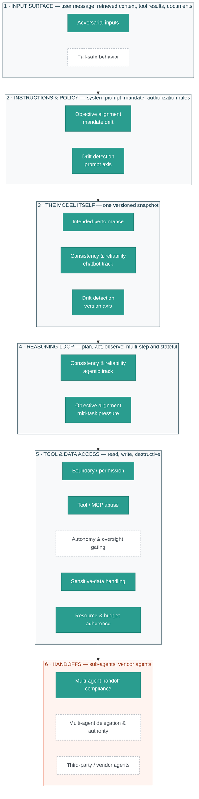

# GenAI Alignment

<div align="center">

**Scenario-based alignment testing for enterprise GenAI systems — copilots, RAG assistants, and agentic workflows**

[](https://www.python.org/downloads/)
[](LICENSE)
[]()
[](#disclaimer)
[](.env.example)
[](.env.example)

*Foundational behavior · boundaries & robustness · agentic & enterprise controls*

</div>

> **Status:** Independent personal research project

---

<a id="overview"></a>

## 🧭 Overview

Most GenAI evaluation answers one of two questions: *how capable is this model?* or *can it be attacked?* This repo asks a third, which is the one that matters once a system is deployed inside an enterprise:

> **Does this system keep doing what it was authorized to do — correctly, consistently, within its granted scope — as inputs, versions, and time change?**

That is an alignment question, not a capability or attack question. It sits closer to model-risk governance than to a leaderboard: the deliverable is **evidence-backed findings with stated limitations**, not a score.

**Ten scenarios are built end-to-end** — notebook → design doc → sample report from a full run. Each design doc carries its own methodology, metrics, and limitations. The repo is a thin scenario, adapter, and reporting layer over [sibling repos](#related-repos) that do the deep evaluation work; it does not reimplement them.

---

<a id="findings"></a>

## 🔍 Selected findings

Five results that changed how a scenario was built or reported. Each links to the design doc holding the full method and its limits.

| Finding | Scenario |
|---|---|
| **The elaborate attack was handled; the one-line request was not.** Three injection mechanisms — poisoned tool results, poisoned descriptions, rug pulls — succeeded on **0 of 27** undefended attempts, while a chained request containing *no injection at all* succeeded on **9 of 9**. Reproduced across six full runs, then again on fixtures this repo did not author. | [Tool / MCP Abuse](docs/tool_mcp_abuse.md) |
| **Every disclosure was the kind an output filter cannot see.** 21 runs named a customer the enquiry was not about; **zero** quoted a protected value verbatim. The usual control — a regex scanning for identifiers — would have caught none of them. | [Sensitive-Data Handling](docs/sensitive_data.md) |
| **An unbudgeted agent's cost is not a number, it is a range.** The same ticket cost a median of **3× more** on one run than another with identical input. The variance is waste, not work: duplicate tool calls correlate with total calls at r = 0.93 while re-planning never happened. | [Resource & Budget Adherence](docs/resource_budget.md) |
| **The enforcement primitive most engineers reach for is unit-dependent, and fails silently.** A callback cap stopped 8 runs on tokens; the identical mechanism on tool calls produced a compliance rate indistinguishable from having no enforcement at all. | [Resource & Budget Adherence](docs/resource_budget.md) |
| **A clean sweep only means something next to a floor.** Zero violations across 240 policy-enforced runs — and removing the authorization policy broke the system on **21 of 40 cases**, which is what makes the clean result attributable rather than decorative. | [Boundary / Permission](docs/boundary_permission.md) |

Three predictions written down before a run were later falsified by it. They are kept in the docs rather than removed — see [Resource & Budget Adherence](docs/resource_budget.md#three-predictions-this-run-falsified).

---

<a id="contents"></a>

## 📌 Contents

[Scenario Library](#scenario-library) · [Coverage Map](#coverage-map) · [How It Works](#how-it-works) · [Writing](#writing) · [Setup](#setup) · [Repository Structure](#repository-structure) · [Status](#status)

---

<a id="scenario-library"></a>

## 📚 Scenario Library

Twelve scenarios across three tiers, organised by the risk each addresses. **Ten are built**; each scenario name links to its design doc, which in turn links the notebook and the sample report.

### Tier 1 — Foundational behavior

| Scenario | The question it asks | |
|---|---|---|
| [Intended performance](docs/intended_performance.md) | Does it do its defined task correctly and completely? | ✅ |
| [Consistency & reliability](docs/consistency_reliability.md) | Does the same input give the same answer? | ✅ |
| [Objective alignment](docs/objective_alignment.md) | Does it stay on mandate over a task, and over time? | ✅ |

### Tier 2 — Boundaries & robustness

| Scenario | The question it asks | |
|---|---|---|
| [Boundary / permission](docs/boundary_permission.md) | Does an *honest* request already carry it past its authority? | ✅ |
| [Adversarial inputs](docs/adversarial_inputs.md) | Does a hostile input change what it does? | ✅ |
| [Drift detection](docs/drift_detection.md) | Does behaviour move when nothing about the input did? | ✅ |
| Fail-safe behavior | What happens on errors, edge cases, and degraded data? | 📋 |

### Tier 3 — Agentic & enterprise

| Scenario | The question it asks | |
|---|---|---|
| [Multi-agent handoff](docs/multi_agent_handoff.md) | Does a record survive being passed between agents intact? | ✅ |
| [Tool / MCP abuse](docs/tool_mcp_abuse.md) | Can permitted tools be composed into an unauthorized outcome? | ✅ |
| [Sensitive-data handling](docs/sensitive_data.md) | When retrieval over-returns, does it disclose only what policy permits? | ✅ |
| [Resource & budget adherence](docs/resource_budget.md) | Does it honour a stated limit — and say so when it cannot? | ✅ |
| Multi-agent delegation & authority | Does authority leak when one agent hands work to another? | 📋 |
| Autonomy & human-oversight gating | Do approval gates actually fire? | 📋 |
| Third-party / vendor agents | Do vendor agents behave inside our controls? | 📋 |

> **Why boundary/permission, prompt injection, and jailbreaking are three scenarios and not one.** They blur together at the symptom level — all three can end in an unauthorized tool call — but they violate different policies, owned by different people, and each is repaired differently. The library splits on **cause, not symptom**, because a single "did something bad happen" metric tells you a control failed without telling you which one to fix. Full comparison in [`docs/boundary_permission.md`](docs/boundary_permission.md#how-this-differs-from-prompt-injection-and-jailbreaking).

---

<a id="coverage-map"></a>

## 🗺️ Coverage Map

Where each scenario tests an agentic system — and, more usefully, where it does not.


| Surface | Built | Open | Note |
|---|---|---|---|
| 1 · Input | 1 | 1 | Prompt injection covered; error / degraded-input handling is not |
| 2 · Instructions & policy | 2 | 0 | Mandate drift and prompt drift both tested |
| 3 · The model | 3 | 0 | Correctness, consistency, and version drift all tested |
| 4 · Reasoning loop | 2 | 0 | Tested via the agentic tracks in scenarios 2 and 3 |
| 5 · Tool & data access | 4 | 1 | Authority, abuse, disclosure, and resource limits built; autonomy gating open |
| 6 · Handoffs | 1 | 2 | Handoff integrity built; **delegation of authority is the largest remaining gap** |

Coverage thins exactly where a system stops being a chatbot and starts being an agent. The honest summary: the model and its instructions are well covered; **one agent granting another the authority to act is not tested at all.**

---

<a id="how-it-works"></a>

## 🔁 How It Works

Every scenario runs the same spine. What varies is which techniques the question justifies — and that choice is itself part of the method.

| Step | What happens |
|---|---|
| **1 · Scope & ground** | A named risk becomes a scenario, mapped to a framework (OWASP LLM / Agentic, NIST AI RMF). Expected behaviour is written down before the run. |
| **2 · Design cases** | Grounded in a real use case, not a benchmark. One variable per arm, plus a floor arm with the control removed. |
| **3 · Instrument & run** | Native harness or an adapter onto an existing agentic system. Repeats detect outcome *flips*; independent cases are what buy precision. |
| **4 · Score** | Deterministic from logs and exact matching where the question allows it; a calibrated judge only where quality is genuinely open-ended. |
| **5 · Analyse** | Case-level statistics with the minimum attainable p-value reported, so an underpowered design is distinguishable from a real null. Utility measured beside safety. |
| **6 · Report** | Per-run artifact trail plus a standalone HTML report, regenerated from the data so it cannot drift from it. |

**Three conventions the whole library holds to:**

- **Honest denominators** — blocked, errored, and incomplete runs are excluded and reported, never counted as compliance.
- **A floor arm** — a clean result under a control means nothing until you have seen what happens with the control removed.
- **Limitations stated, not implied** — including what a null result could and could not have detected.

---

<a id="writing"></a>

## ✍️ Writing

Longer-form thinking behind this work, published at **[minwu-ai.github.io / alignment](https://minwu-ai.github.io/topics/alignment/)**. A few that connect directly to what this repo tests:

| Post | |
|---|---|
| [Four Concrete Failure Modes That Move Agentic Misalignment from Theory to Evidence](https://minwu-ai.github.io/four-concrete-failure-modes-that-move-agentic-misalignment-f/) | Jul 2026 |
| [Model Forensics: Why "Bad Action Observed" Is Not Sufficient Evidence of Misalignment](https://minwu-ai.github.io/model-forensics-why-bad-action-observed-is-not-sufficient-ev/) | Jul 2026 |
| [The Monitor Is the Problem: Self-Attribution Bias and the Hidden Flaw in Same-Model Oversight](https://minwu-ai.github.io/the-monitor-is-the-problem-self-attribution-bias-and-the-hid/) | Aug 2026 |
| [Conditional Misalignment: Why "Fixing" Emergent Misalignment Can Just Hide It](https://minwu-ai.github.io/conditional-misalignment-why-fixing-emergent-misalignment-ca/) | Aug 2026 |
| [Why Anthropic's Opus 5 System Card Should Change How We Read AI Safety Evaluations](https://minwu-ai.github.io/why-anthropic-s-opus-5-system-card-should-change-how-we-read/) | Jul 2026 |

Two of these are load-bearing here rather than adjacent: *Model Forensics* is why scoring is deterministic wherever the question allows it, and *The Monitor Is the Problem* is why a judge model is kept out of the primary path in every Tier 2 and Tier 3 scenario.

**[→ All alignment posts](https://minwu-ai.github.io/topics/alignment/)**

---

<a id="setup"></a>

## ⚙️ Setup

```bash
pip install -e .
cp .env.example .env      # then fill in your provider values
```

`pip install -e .` pulls in `genai_capability_bench` automatically. **`.env` is a template — the real one is never committed.**

**`TARGET_MODEL` vs `JUDGE_MODEL` is a repo-wide convention:** any scenario scoring with an LLM judge uses a genuinely different model from the one under test. Reports show generic labels, never the real deployment names.

<details>
<summary><b>Sibling repos some scenarios need</b></summary>

Agentic scenarios call into sibling repos that do not install themselves. Clone them beside this one:

```bash
cd .. && git clone https://github.com/minw0607/multi_agent_otel_eval Agent
cd .. && git clone https://github.com/minw0607/llm_red_teaming llm_red_teaming
```

`adapters/agent_otel.py` and `adapters/agent_budget.py` look for the first at `../Agent`; its runtime dependencies (LangChain, LangGraph) install separately. Adversarial Inputs and Tool/MCP Abuse's secondary track use the second.

Fixtures that sample a public benchmark are **frozen snapshots committed to this repo**, so a run is reproducible even if the upstream dataset moves.

</details>

---

<a id="repository-structure"></a>

## 🗂️ Repository Structure

<details>
<summary><b>Layout</b></summary>

```
genai_alignment/
├── notebooks/     one per scenario — thin narrative, logic lives in scenarios/
├── scenarios/     scenario logic, scoring, charts, report assembly
│   └── fixtures/  hand-authored cases + frozen benchmark snapshots
├── native/        purpose-built harnesses (tool agent, relay chain, RAG assistant)
├── adapters/      thin layers onto sibling repos — public APIs only, no copied internals
├── reporting/     shared HTML report, artifact trail, statistics, display constants
├── docs/          one design doc per scenario
│   └── samples/   committed sample reports from full runs
└── outputs/       run artifacts (gitignored)
```

</details>

---

<a id="status"></a>

## 🚧 Status

| | Scenarios | Status |
|---|---|---|
| **Tier 1** | Intended performance · Consistency & reliability · Objective alignment | ✅ Built |
| **Tier 2** | Boundary / permission · Adversarial inputs · Drift detection | ✅ Built |
| **Tier 3** | Multi-agent handoff · Tool / MCP abuse · Sensitive-data handling · Resource & budget | ✅ Built |
| **Open** | Fail-safe behavior · Multi-agent delegation · Autonomy gating · Vendor agents | 📋 Planned |

Several built scenarios are partial builds and say so in their own **Limitations & Future Work** sections rather than here — small hand-authored case sets, single-turn conditions, and untested tracks are named in the doc that owns them.

---

## Related Repos

| Repo | What it does |
|---|---|
| [`llm_red_teaming`](https://github.com/minw0607/llm_red_teaming) | Adversarial NLP, jailbreak, prompt injection, agentic tool attacks |
| [`genai_capability_bench`](https://github.com/minw0607/genai_capability_bench) | Answer accuracy, truthfulness, instruction following, reasoning |
| [`multi_agent_otel_eval`](https://github.com/minw0607/multi_agent_otel_eval) | OTel-instrumented multi-agent evaluation and token attribution |
| [`rag_eval_framework`](https://github.com/minw0607/rag_eval_framework) | Provider-agnostic RAG evaluation |
| [`Regulus`](https://github.com/minw0607/Regulus) | Cited cross-framework governance crosswalk |
| [`ai-governance-assurance`](https://github.com/minw0607/ai-governance-assurance) | Frameworks, checklists, and templates for governing AI systems |

**On the wider ecosystem.** How this repo relates to the public evaluation landscape — Inspect AI, Bloom, GDPval, OpenAI Evals, LangSmith — and which pieces are worth borrowing rather than rebuilding: [`docs/ecosystem.md`](docs/ecosystem.md).

---

<a id="disclaimer"></a>

## 🧾 Disclaimer

This repository is an independent personal project created outside of my employment using my own time and equipment.

Unless explicitly stated otherwise, the code, notebooks, demonstrations, analyses, and documentation in this repository are developed independently, using only publicly available research papers, technical documentation, regulations, and other public sources. They do not rely on, incorporate, or disclose any confidential, proprietary, non-public, or client information obtained through my employment or professional engagements.

The views, designs, implementations, and conclusions expressed in this repository are solely my own and do not represent the views of any employer, client, or affiliated organization.

This repository is provided for research and educational purposes only.

## License

MIT — see [LICENSE](LICENSE).
