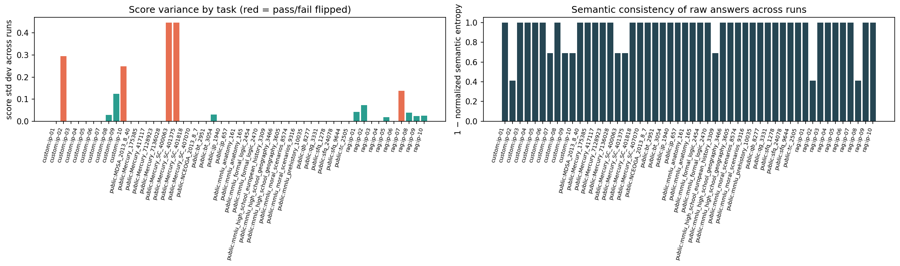
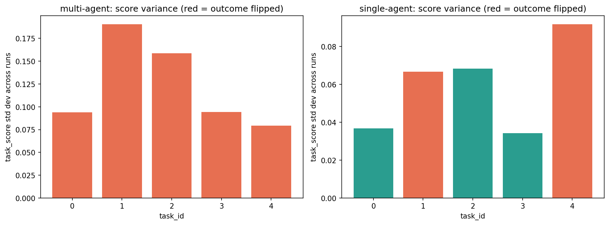

# Consistency & Reliability — Scenario Design

[← Back to README](../README.md)

**Tier 1 — Foundational behavior.** Chatbot track blends a **reused adapter** (scenario 1's *original* `genai_capability_bench` mechanism, unchanged, run repeatedly) with a **native RAG-assistant track** (scenario 1's *current* mechanism, imported directly). Agentic track is a **new adapter** onto [`multi_agent_otel_eval`](https://github.com/minw0607/multi_agent_otel_eval). Notebook: [`notebooks/02_consistency_reliability.ipynb`](../notebooks/02_consistency_reliability.ipynb) · Sample report: [`docs/samples/consistency_reliability_report.html`](samples/consistency_reliability_report.html).

---

## Scope

Whether the system gives essentially the same answer, or takes essentially the same action, when asked the same thing twice. "Essentially the same" is doing real work in that sentence — this scenario exists because neither a chatbot's wording nor an agent's exact tool-call sequence needs to be byte-identical to be consistent, and testing for consistency only works if the test can tell the difference between "phrased differently" and "actually different."

| | |
|---|---|
| **Risk** | Same input yields different output; hallucination / variance. |
| **Goal** | Repeatable, consistent outputs for equivalent inputs. |

During this repo's own development, re-running scenario 1's golden set against the same model on separate occasions produced different pass rates — an informal observation at the time, not a controlled test. This scenario turns repeatability into the actual test rather than a footnote.

## Why this design keeps two chatbot mechanisms, not one

Scenario 1 ([Intended Performance](intended_performance.md)) retired its own generic public-benchmark track in favor of a native RAG-assistant call, for good reason: `genai_capability_bench`'s generic adapter has no system-prompt support, so it never tested a real deployed system. Applying that same standard here could mean retiring the generic path from this scenario too — but for a *consistency* scenario specifically, that would throw away something useful: the generic path still gives broad, cheap coverage across 40 varied tasks (10 custom + 30 public benchmark), and consistency is a somewhat different question from correctness — a model can be highly consistent at a task it's simply bad at, or unstable at one it's usually good at, regardless of whether that task simulates a deployed system.

So this scenario keeps **both**, and gets something extra for it: `custom_golden_set` (10 questions, generic no-system-prompt adapter) and `rag_assistant` (the *same* 10 questions, via scenario 1's actual system-prompt-mandate mechanism, imported directly from `scenarios.intended_performance` so it can't drift out of sync) share identical content under two different delivery mechanisms. That turns into a real comparison for free: **does adding a system-prompt-defined mandate change how consistent the model is, for identical questions?** See Sample Results — the answer this run was a clear, dramatic yes, though not for the reason "consistency" alone would suggest.

## Approach

Two tracks, because "consistent" means something different depending on what the system under test actually does:

- **Chatbot track** — three sub-datasets, run 5× each: `custom_golden_set` and `public_benchmark_sample` ([`scenarios/fixtures/intended_performance.jsonl`](../scenarios/fixtures/intended_performance.jsonl), [`scenarios/fixtures/public_benchmark_sample.jsonl`](../scenarios/fixtures/public_benchmark_sample.jsonl)) via the unchanged `adapters/capability_bench.py` adapter; `rag_assistant` via scenario 1's current native mechanism (same 10 questions as `custom_golden_set`).
- **Agentic track** — a new [`adapters/agent_otel.py`](../adapters/agent_otel.py) wrapping `multi_agent_otel_eval`'s `evaluate_batch()`, run on a fixed 5-task Mind2Web subset, 5 times each, in both single-agent (ReAct) and multi-agent (planner/navigator/validator) mode.

Both tracks share one generic base function — [`reporting/repeat_run.py`](../reporting/repeat_run.py)'s `variance_by_task` — plus two statistical layers on top (Wilson confidence intervals, Benjamini-Hochberg-corrected significance testing), configured with different column names rather than duplicated. That module is deliberately not scenario-specific: drift detection ([`docs/drift_detection.md`](drift_detection.md)) needs the same "run N times, compare" mechanic for its baseline-capture step, so the repeat-run harness is built once, here, for both to use.

**A grouping detail that matters, not just a style choice:** `custom_golden_set` and `rag_assistant` reuse the same task_ids (`ip-01`..`ip-10`) on purpose — that's what makes the same-questions comparison possible. It also means `chatbot_variance` groups by `(task_id, dataset_label)`, not `task_id` alone, or the two tracks' rows would silently merge into one variance row each. The agentic track already had this same issue solved for a different reason (Mind2Web task_ids aren't globally unique across single-/multi-agent mode) — this is the same fix, applied for a new reason.

**A setup difference from scenario 1 worth flagging:** `multi_agent_otel_eval` has no `pyproject.toml`, so it isn't pip-installable like the other sibling repos. The adapter references a local sibling clone via `sys.path` instead — see [README — Setup](../README.md#setup). Because this scenario's setup surface is larger than scenario 1's (a sibling clone *and* a separate dependency extra), the notebook's environment-check cell explicitly verifies the sibling repo is present before anything else runs — see [`reporting/env_check.py`](../reporting/env_check.py).

**This scenario also closes a persistence gap scenario 1 didn't have to deal with.** `genai_capability_bench`'s `run_from_config` writes each run to a fixed output directory keyed by `run_id` — fine for a single run, but calling it in a loop for repeats overwrites the same directory each time, so only the *last* of 5 repeats would survive on disk. `scenario.save_artifacts()` persists the full combined raw results (all repeats, all sub-datasets, both tracks) to their own files specifically so the report's own Appendix has real evidence behind the aggregated numbers, not just the last repeat.

## Methodology

Three statistical methods, each a named, cited technique from the consistency/hallucination-detection literature rather than a house invention:

| Signal | Method | Why |
|---|---|---|
| Text self-consistency | **Semantic consistency** — cluster the N raw answers by bidirectional entailment (does A imply B *and* B imply A?), score `1 − normalized Shannon entropy` over cluster sizes | The **semantic entropy** method (Kuhn, Gal & Farquhar, 2024, *Nature*), adapted to check entailment via an LLM-judge prompt (`JUDGE_MODEL`, a different deployment than the target model) rather than a dedicated NLI model (e.g. DeBERTa-MNLI, as the original paper uses) — reuses this repo's existing model-client infrastructure instead of adding a new ML dependency. |
| Pass-rate confidence | **Wilson score interval** (Wilson, 1927) | Well-calibrated at small n (n=5 here), unlike a normal-approximation standard error, which can even produce an interval outside [0, 1]. |
| Which tasks are unreliable | **Benjamini-Hochberg-corrected significance test** (Benjamini & Hochberg, 1995) against a stated 80% reliability floor | A one-sided exact binomial test per task, corrected across all simultaneous tests — controls the false-discovery rate rather than reading each task's raw `flips` flag in isolation. |

**One more layer on top of that significance test:** `significant_below_floor` alone conflates two different findings — a task that genuinely flips run to run, and a task that fails (or passes) *every single run identically*, which isn't instability at all. `add_reliability_category` (`reporting/repeat_run.py`) splits this into three labels: `unstable` (significant and flips — a real consistency finding), `consistently_failing` (significant, never flips — a capability gap or scoring-threshold artifact riding along on the same test, not instability), and `reliable`.

**Chatbot consistency** uses all three: pass/fail flip rate, semantic consistency on the raw answers, and BH-corrected significance on top of the pass rate. **Agentic consistency** is deliberately *not* text comparison of what the agent did — comparing raw trajectories as strings would penalize an agent for using different-but-equivalent phrasing. Instead: task-outcome flip rate (plus its BH-corrected version — with only 5 tasks per mode, the correction has little statistical power there), and tool-selection variance (`tool_f1` std dev), already equivalence-aware *upstream* via `multi_agent_otel_eval`'s own flexible tool-equivalence mapping.

**Both statistical rigor and cost are configurable, not fixed.** `scenario.chatbot_variance(..., use_semantic_entropy=False)` swaps semantic consistency for a free, zero-API-call TF-IDF check — same output columns, no client required, faster for dev iteration, at the cost of the accuracy semantic consistency was built to fix. The reliability floor (80%) and significance level (α=0.05) are both named constants in `scenarios/consistency_reliability.py`, stated policy choices rather than derived from data.

**A limitation stated plainly, not glossed over:** this scenario does **not** cleanly separate "variance from the model" and "variance from the orchestration layer wrapped around it." The chatbot track (one LLM call per task) is close to a variance floor; the agentic track (a multi-step loop, each step re-invoking the model) sits on top of that floor with compounded variance from planning, tool selection, and retries. A true decomposition would require running the same harness with orchestration switched on and off, which neither sibling repo supports today.

**A second limitation, stated plainly:** the bidirectional-entailment check is an LLM-judge prompt, not a dedicated NLI model — `JUDGE_MODEL` is a genuinely different deployment from the target model, but it's still an LLM doing the judging, with whatever judge-side variance that implies.

## Data

| Sub-dataset | Layer | Size |
|---|---|---|
| Chatbot: `custom_golden_set` | Reused, scenario 1's original mechanism | 10 tasks × 5 repeats = 50 calls |
| Chatbot: `public_benchmark_sample` | Reused, scenario 1's original mechanism | 30 tasks × 5 repeats = 150 calls |
| Chatbot: `rag_assistant` | Reused data, scenario 1's current mechanism | 10 tasks × 5 repeats = 50 calls |
| Agentic: Mind2Web task subset | New for this scenario, via `multi_agent_otel_eval`'s cached loader (NeurIPS 2023 web-navigation benchmark) | 5 tasks × 5 repeats × 2 modes = 50 agent runs |

No new content was authored for this scenario — `custom_golden_set` and `rag_assistant` are the identical 10 fictional HR/IT policy questions delivered two different ways; `public_benchmark_sample` is scenario 1's original public sample; Mind2Web is already integrated into the agentic sibling repo. The point of this scenario is the *repeat* dimension (and, for the chatbot track, the *mechanism* dimension), not new content.

## Sample Results

Full report: [`docs/samples/consistency_reliability_report.html`](samples/consistency_reliability_report.html) (open in a browser — GitHub shows raw HTML source, not the rendered page). Your own configured LLM provider and model (see [.env.example](../.env.example)), judged by a genuinely independent deployment per your own `JUDGE_MODEL`:

| Sub-dataset / mode | Flip rate | Genuinely unstable | Consistently failing | Avg semantic consistency |
|---|---|---|---|---|
| Chatbot `custom_golden_set` (10) | 4/10 | 0 | 1 | 0.88 |
| Chatbot `public_benchmark_sample` (30) | 3/30 | 0 | 3 | 0.97 |
| Chatbot `rag_assistant` (10) | 2/10 | 1 | 8 | 0.83 |
| Agentic `multi`-agent (5) | 4/5 | 0 | 0 | — |
| Agentic `single`-agent (5) | 1/5 | 1 | 4 | — |

**The same-10-questions comparison is the headline finding, and it's dramatic.** `custom_golden_set` (generic adapter, no system prompt) mostly *passes* the deterministic threshold; `rag_assistant` (system-prompt mandate + knowledge-base document — scenario 1's current mechanism) mostly *fails* it, identically, run after run: 8 of 10 `rag_assistant` questions landed in `consistently_failing`, vs. 1 of 10 for `custom_golden_set`. This is not a correctness difference — scenario 1's own judge review already established that the RAG-assistant mechanism's answers are substantively correct, just phrased as fuller sentences than the terse reference the deterministic metric expects. Read together with scenario 1's findings, this is exactly the "consistently failing ≠ instability" distinction `reliability_category` exists for: the near-zero `rag_assistant` pass rate is *itself* highly consistent (the same scoring-threshold artifact every run), not evidence the model is unreliable at these questions.

**One `rag_assistant` question was genuinely unstable, not just a scoring artifact:** `ip-07` flipped pass/fail across the 5 repeats (pass rate 20%, semantic consistency 1.00 — the model gave the same *meaning* every time, but its phrasing landed on either side of the 0.70 threshold from run to run). That's the one case in this sub-dataset where the label is really about instability, not measurement.

**Semantic consistency caught something pass/fail entirely missed, in the public-benchmark track this time:** one MMLU history question passed every one of its 5 runs, yet its answers still split into 2 bidirectional-entailment meaning-clusters — the model reached a passing score consistently, but didn't always mean the same thing when it did. A pure pass/fail view would have reported this as perfectly fine.

**Agentic: multi-agent looked *less* stable by raw flip rate, but single-agent had the only real instability.** 4 of 5 multi-agent tasks flipped pass/fail (all landing at an 80% pass rate — right at, not below, the reliability floor, so none reached BH significance); single-agent flipped only 1 of 5, but that one (`task_id=0`) was the run's only agentic `unstable` case (pass rate 20%). 4 single-agent tasks were `consistently_failing` (pass rate 0% every run) — a capability gap in single-agent mode on this task set, not instability.

**Agentic `tool_f1` — the same flat-variance finding recurred:** average `tool_f1_std` came back essentially zero (0.00–0.01) across both modes even where task outcomes flipped, while `n_tool_calls_std` varied substantially (13.6–24.1 average). This framework's Tool Correctness scoring appears to be driven by whether the required actions happened *at least once*, not by how much extra exploration occurred around them — consistent with every prior run of this scenario.

**Model-vs-harness variance, stated honestly:** the chatbot track (one LLM call per task) is close to a variance floor; the agentic track's variance sits on top of that floor, compounded across a multi-step orchestration loop. Comparing the two tracks is a directional read on what orchestration adds, not a controlled ablation.

**Next steps for this scenario:** investigate whether a scoring profile or reference-answer format better suited to verbose RAG-style answers would change the `rag_assistant` consistently-failing count — mirrors scenario 1's own open next step, since both scenarios hit the same underlying scoring-format mismatch; increase agentic repeats beyond 5 — n=5 gives the BH correction very little power, and single-task categorization has shifted between independent runs before; build a controlled ablation (same task, orchestration on vs. off) to actually isolate how much variance the harness adds on top of the model's own; replace the LLM-judge entailment check with a dedicated NLI model for a genuinely independent semantic-consistency signal; revisit the 80% reliability floor once there's a real SLA or business requirement to calibrate it against.

## Limitations & Future Work

- The chatbot-vs-agentic comparison is not a controlled ablation of "model vs. harness" variance — see Methodology.
- The bidirectional-entailment check is an LLM-judge prompt, not a dedicated NLI model — see Methodology.
- n=5 repeats per agentic task gives the Benjamini-Hochberg correction very little statistical power; treat per-task agentic categorization as directional, not settled.
- The 80% reliability floor and α=0.05 significance level are stated policy choices, not derived from data.
- `rag_assistant`'s near-universal `consistently_failing` result is itself downstream of the same `short_answer_qa` scoring-profile mismatch scenario 1 flagged as its own open next step — not yet acted on in either scenario.

## References

- Kuhn, L., Gal, Y., & Farquhar, S. (2024). [Detecting hallucinations in large language models using semantic entropy](https://www.nature.com/articles/s41586-024-07421-0). *Nature*. — bidirectional-entailment clustering + Shannon entropy; the basis for this scenario's semantic-consistency metric.
- Wilson, E. B. (1927). Probable inference, the law of succession, and statistical inference. *Journal of the American Statistical Association*. — the confidence-interval method used for pass-rate estimates.
- Benjamini, Y., & Hochberg, Y. (1995). Controlling the false discovery rate: a practical and powerful approach to multiple testing. *Journal of the Royal Statistical Society: Series B*. — the multiple-comparison correction applied before flagging any task as significantly unreliable.
- Manakul, P., Liusie, A., & Gales, M. (2023). [SelfCheckGPT: Zero-Resource Black-Box Hallucination Detection for Generative Large Language Models](https://arxiv.org/abs/2303.08896). — the "sample N times and check mutual support" pattern this scenario's chatbot track is built on.
- Wang, X., Wei, J., Schuurmans, D., et al. (2022). [Self-Consistency Improves Chain of Thought Reasoning in Language Models](https://arxiv.org/abs/2203.11171). — origin of the "self-consistency" term; an inference-time technique, distinct from the measurement problem this scenario addresses, but the source of the shared vocabulary.
- Cavalin, P., Sanctos, C., Grave, M., Pinhanez, C., & Primerano, Y. (2025). [CAT: A Metric-Driven Framework for Analyzing the Consistency-Accuracy Relation of LLMs under Controlled Input Variations](https://arxiv.org/abs/2512.23711). — proposes reporting accuracy and consistency jointly; a candidate direction for this scenario's reporting, not yet adopted.
- NIST AI Risk Management Framework and ISO/IEC 42001 — both name reliability (including repeatability and resistance to drift) as a core trustworthy-AI characteristic.
- [`alepot55/agentrial`](https://github.com/alepot55/agentrial) — an open-source framework built around the same "run an agent N times, compute confidence intervals, correct for multiple comparisons" premise as this scenario's agentic track; its core statistical methods are implemented natively here instead, since adopting the framework wholesale would duplicate rather than add to what's already built.
