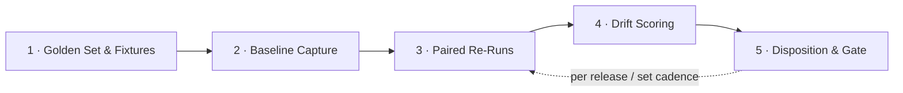

# Drift Detection — Scenario Design

[← Back to README](../README.md)

**Tier 2 — Boundaries & robustness.** This scenario is one of the six with no equivalent in a sibling repo — it is native to `genai_alignment`. This doc captures its design at the same level of detail the notebook and adapter/native module will implement.

---

## Risk, Goal, and the Audit Question

| | |
|---|---|
| **Risk** | Outputs change over time with no input change, driven by silent model, tool, or prompt updates. |
| **Goal** | Behavior is stable absent input change; any material change is detected, explained, and gated. |
| **The audit question** | Would Internal Audit know, with evidence, when an agent's behavior materially changed? |

That last line is the actual bar this scenario has to clear. A drift-detection harness that only produces a metric isn't enough — it has to produce something Internal Audit could point to as evidence *at the time the change happened*, not reconstruct after the fact.

---

## Pipeline: Scenario Build → Execution

Steps 1–2 are **scenario build** (one-time setup); steps 3–5 are **execution**, and repeat — this is the same repeat-loop already described in the [general testing strategy](../README.md#testing-strategy), specialized for drift.

### 1 · Golden Set & Fixtures — *scenario build*

Freeze a representative input set; pin the retrieval corpus, tool responses, and reference data so any output change is attributable to the agent — not to the inputs shifting under it. This is a stricter version of the [data-strategy](#data--fixtures) rule for other native scenarios: it's not enough to freeze the *prompts*, the entire environment the agent reasons over has to be pinned, or a drift score can't tell you whether the agent changed or its inputs did.

**Output:** Frozen golden set.

### 2 · Baseline Capture — *scenario build*

Run the golden set N× on the current version; record outputs, full traces, and the complete config that produced them — model/version ID, prompt hash, tool schemas, sampling parameters. This becomes the reference point every future re-run is compared against, and it has to be versioned, not overwritten.

**Output:** Versioned baseline.

### 3 · Paired Re-Runs — *execution*

Replay the identical golden set against the candidate — after any model, tool, or prompt change, and again on a set cadence regardless of whether a change was announced. Repeated sampling (not a single run) is what separates true drift from ordinary stochastic noise.

**Output:** Candidate run traces.

### 4 · Drift Scoring — *execution*

Score the candidate against the baseline: semantic distance, structured-field diffs, task-success delta, refusal-rate shift — each evaluated against tolerance bands agreed *before* the run, not chosen after seeing the result.

**Output:** Drift metrics vs. thresholds.

### 5 · Disposition & Gate — *outcome*

Within tolerance → pass. Material drift → a finding, unless it's tied to a change that was gated and documented (i.e., an intentional, approved update, not a silent one). Every run — pass or fail — produces an audit-ready evidence pack; passing quietly is still evidence.

**Output:** Pass · gated change · finding.

---

## "One month isn't enough to see drift" — test the control, not the calendar

A single before/after diff can't tell real drift from noise, and can't tell you whether the *harness* would even catch drift if it happened. Three checks close that gap:

- **Calibrate the noise floor** — N× baseline runs quantify normal run-to-run variance; tolerance bands are set against that measured floor, not a guessed threshold.
- **Inject controlled drift** — deliberately swap the model version or perturb the prompt/tool config, and confirm the harness flags it — and stays quiet when nothing changed. A drift detector that's never been shown to detect anything isn't validated.
- **Backtest across versions** — replay the golden set against prior model snapshots where available, observing months of accumulated drift in a single comparison rather than waiting for it to occur in real time.

**Then: the control operates.** Drift detection is a monitoring control, not a point-in-time test — the harness re-runs per release and on a set cadence, and the calibrated baseline, thresholds, and capability stay with Internal Audit, not with whoever ran it once.

---

## Minimal requirements to run

- **Access to each agent** — API where available, else UI with a dedicated test account.
- **Version visibility** — model ID, prompt & parameters if exposed; else vendor release notes as a fallback signal.
- **Representative tasks per agent** — sourced from the use-case owners; synthetic, never production data.
- **One workstation or VM inside the environment** — to run the harness and store all artifacts.

That last point matters for `genai_alignment` specifically: the harness runs *inside* the environment being tested, not as an external SaaS call, so the evidence trail never leaves the boundary it's auditing.

---

## Data & fixtures

The golden set reuses the same task set as [intended performance](../README.md#scenario-library) and [consistency & reliability](../README.md#scenario-library) — no new prompt content is authored for this scenario. What's new is **versioning and environment-pinning**: the prompts alone aren't sufficient fixtures here, because a drift scenario has to rule out "the retrieval corpus changed" or "the tool's mock response changed" before attributing a diff to the agent itself. Practically, this means the fixture schema (see the [data-strategy discussion](../README.md#capabilities)) needs a `frozen_context` field per case — retrieval snapshot ID, tool-response fixtures, reference data version — alongside the prompt and expected-behavior fields already planned.

## Mapping back to the general pipeline

| Drift-specific step | General six-stage pipeline stage |
|---|---|
| Golden Set & Fixtures | 2 · Build & Operationalize |
| Baseline Capture | 2 · Build & Operationalize (first execution, retained as reference) |
| Paired Re-Runs | 4 · Execute & Validate |
| Drift Scoring | 5 · Evaluate vs Criteria |
| Disposition & Gate | 6 · Findings & Reporting |

No new pipeline stages are needed — drift detection is the general pipeline with a mandatory versioned-baseline artifact and a repeat cadence, which is exactly what the [repeat loop](../README.md#the-repeat-loop) in the README already anticipated.
