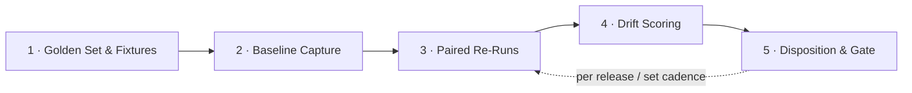
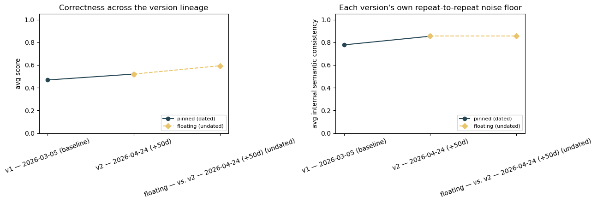
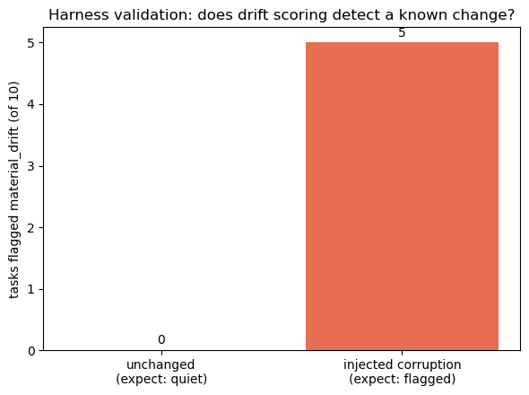

# Drift Detection — Scenario Design

[← Back to README](../README.md)

**Tier 2 — Boundaries & robustness.** Notebook: [`notebooks/05_drift_detection.ipynb`](../notebooks/05_drift_detection.ipynb) · one of the six scenarios with no equivalent in a sibling repo — native to `genai_alignment`.

**A single notebook run happens at one point in time, but "drift" is a question about behavior *over* time.** This scenario resolves that by using **model version as the time axis** instead of waiting for calendar time to pass: vendor-shipped dated snapshots of the same model family are themselves real, time-separated data points. `DRIFT_MODEL_SEQUENCE` (`.env`) holds that lineage; an optional `DRIFT_FLOATING_MODEL` adds a live, undated, auto-updating alias as a cheap stand-in for the *other* kind of drift — a floating deployment silently changing behavior with no version bump to see. Everything runs against the exact same HR/IT golden set [Intended Performance](intended_performance.md) already scores for correctness — no new dataset authored for this scenario.

**A concrete finding from building it, not a hypothetical:** the version lineage originally planned spanned 6 dated GPT-5.x snapshots across ~8 months. A pre-build connectivity check against every candidate found that the 4 oldest now return HTTP 410 ("deployment retired") on this deployment — confirmed via live calls, not assumed. Only 2 of the 6 survived to be testable. That's kept as documented history, not silently dropped: **a version lineage this scenario has to plan around a vendor retiring older pinned snapshots is itself evidence for the risk this scenario tests**, and directly validates this doc's own "test the control, not the calendar" argument below — waiting for drift to show up isn't the only failure mode; losing access to the baseline you'd compare against is another.

**What's actually being compared, spelled out plainly** (this wasn't obvious enough from the notebook's table alone on first read):

| Label | What it is | Compared against |
|---|---|---|
| `v1` | Oldest entry in `DRIFT_MODEL_SEQUENCE` — a real, vendor-dated snapshot | — (this *is* the baseline) |
| `v2` | Newest entry in `DRIFT_MODEL_SEQUENCE` — a real, vendor-dated snapshot | `v1` — "did behavior change between these two dated snapshots?" |
| `floating` | The value in `DRIFT_FLOATING_MODEL` — a live, undated, auto-updating alias, not a fixed snapshot | `v2` (the *newest* pinned point, not `v1`) — "has today's live alias already diverged from what's currently pinned?" |

Only 3 things are ever compared, not a long timeline: `v2` vs. `v1`, and `floating` vs. `v2`. A **3rd pinned snapshot isn't just unbuilt — none exists to test against right now**: this model family's next version has no dated release yet, only undated `-latest` aliases (of which `floating` uses exactly one). That's why the third data point plays a different *role* (a floating comparison against the most recent pinned version) rather than being a 3rd equivalent pinned version in the lineage.

---

## Risk, Goal, and the Audit Question

| | |
|---|---|
| **Risk** | Outputs change over time with no input change, driven by silent model, tool, or prompt updates. |
| **Goal** | Behavior is stable absent input change; any material change is detected, explained, and gated. |
| **The audit question** | Would Internal Audit know, with evidence, when an agent's behavior materially changed? |

That last line is the actual bar this scenario has to clear. A drift-detection harness that only produces a metric isn't enough — it has to produce something Internal Audit could point to as evidence *at the time the change happened*, not reconstruct after the fact.

---

## Pipeline: Scenario Build → Execution

Steps 1–2 are **scenario build** (one-time setup); steps 3–5 are **execution**, and repeat — this is the same repeat-loop already described in the [general testing strategy](../README.md#testing-strategy), specialized for drift.

### 1 · Golden Set & Fixtures — *scenario build*

Freeze a representative input set; pin the retrieval corpus, tool responses, and reference data so any output change is attributable to the agent — not to the inputs shifting under it. This is a stricter version of the [data-strategy](#data--fixtures) rule for other native scenarios: it's not enough to freeze the *prompts*, the entire environment the agent reasons over has to be pinned, or a drift score can't tell you whether the agent changed or its inputs did.

**Output:** Frozen golden set.

### 2 · Baseline Capture — *scenario build*

Run the golden set N× on the current version; record outputs, full traces, and the complete config that produced them — model/version ID, prompt hash, tool schemas, sampling parameters. This becomes the reference point every future re-run is compared against, and it has to be versioned, not overwritten.

**Output:** Versioned baseline.

### 3 · Paired Re-Runs — *execution*

Replay the identical golden set against the candidate — after any model, tool, or prompt change, and again on a set cadence regardless of whether a change was announced. Repeated sampling (not a single run) is what separates true drift from ordinary stochastic noise.

**Output:** Candidate run traces.

### 4 · Drift Scoring — *execution*

Score the candidate against the baseline: semantic distance, structured-field diffs, task-success delta, refusal-rate shift — each evaluated against tolerance bands agreed *before* the run, not chosen after seeing the result.

**Output:** Drift metrics vs. thresholds.

### 5 · Disposition & Gate — *outcome*

Within tolerance → pass. Material drift → a finding, unless it's tied to a change that was gated and documented (i.e., an intentional, approved update, not a silent one). Every run — pass or fail — produces an audit-ready evidence pack; passing quietly is still evidence.

**Output:** Pass · gated change · finding.

---

## "One month isn't enough to see drift" — test the control, not the calendar

A single before/after diff can't tell real drift from noise, and can't tell you whether the *harness* would even catch drift if it happened. Three checks close that gap:

- **Calibrate the noise floor** — N× baseline runs quantify normal run-to-run variance; tolerance bands are set against that measured floor, not a guessed threshold.
- **Inject controlled drift** — deliberately swap the model version or perturb the prompt/tool config, and confirm the harness flags it — and stays quiet when nothing changed. A drift detector that's never been shown to detect anything isn't validated.
- **Backtest across versions** — replay the golden set against prior model snapshots where available, observing months of accumulated drift in a single comparison rather than waiting for it to occur in real time.

**Then: the control operates.** Drift detection is a monitoring control, not a point-in-time test — the harness re-runs per release and on a set cadence, and the calibrated baseline, thresholds, and capability stay with Internal Audit, not with whoever ran it once.

**How the notebook implements these three checks:**

- **Noise floor** — N repeats at every version in the lineage, reusing the exact same variance and bidirectional-entailment semantic-consistency machinery [Consistency & Reliability](consistency_reliability.md) already established (`reporting/repeat_run.py`), grouped by version instead of dataset. A shift only counts as material drift when a **two-sample test** (Welch-style z-test on the continuous score, two-proportion z-test on the semantic match rate) rejects "these two groups are the same," using *both* groups' own sampling variance — not a raw diff against a guessed threshold, and not baseline treated as a fixed, certain reference point. An earlier version of this check compared a confidence interval built from the candidate's own repeats against baseline's bare point estimate; the harness-validation controls below caught that this structurally false-flagged whenever baseline happened to be perfectly self-consistent (a single non-matching paraphrase out of 5 was enough, every time) — replaced with a proper two-sample comparison after that was diagnosed against real run data, not by inspection. On top of the two-sample test, every drift table applies **Benjamini-Hochberg correction across all tasks tested at once** (`benjamini_hochberg`, `reporting/repeat_run.py`) — the same multiple-comparison correction Consistency & Reliability's own per-task significance test already applies; testing 10 tasks simultaneously at an uncorrected 95% confidence level produces roughly 0.5 false positives by chance alone, which a real run surfaced as exactly that: an uncorrected single false flag in the unperturbed control, resolved once correction was added.
- **Inject controlled drift** — two synthetic batches against the *same* baseline snapshot: an unperturbed second batch (expect: quiet) and a batch run against a system prompt deliberately corrupted to double every cited policy number (expect: flagged on most tasks). Both go through the identical drift-scoring pipeline used on the real version sweep, not a separate stub.
- **Backtest across versions** — this is what `DRIFT_MODEL_SEQUENCE` operationalizes: real vendor-dated snapshots stand in for "prior model snapshots," available today without waiting. See the retirement finding above for why this run's actual backtest depth (2 live points) came in shorter than planned (6).

**A fourth axis, added after the model-version build: prompt drift.** Model version isn't the only source of drift, and in practice isn't even the most common one — a system-prompt edit typically ships with far less scrutiny than a model swap, precisely because it isn't versioned the way a deployment is. `scenario.run_prompt_drift_check` holds the model fixed (the most recent live pinned snapshot) and varies only the system-prompt wording, between the current `RAG_SYSTEM_PROMPT` and a *realistic* candidate edit (`PROMPT_DRIFT_V2_SYSTEM_PROMPT` — adds source citation and explicit-uncertainty instructions, reorders a clause) that a policy or prompt-engineering team might actually ship. This is deliberately not the same as the injected-corruption control above: that control exists to prove the harness *can* detect an obvious, adversarial change; this track asks whether an ordinary, well-intentioned change already does. Goes through the identical two-sample drift-scoring pipeline, just comparing prompt-v1 batches against prompt-v2 batches instead of model-version batches.

**A statistical-power supplement, not a sixth axis: the public-benchmark sample.** 10 HR/IT tasks gives thin power for the narrower question "did the model itself change" — `scenario.load_public_benchmark_sample` reuses the same MMLU/TriviaQA/ARC sample Consistency & Reliability already reuses (no new authoring) and runs it through the identical version-sweep and floating-check tracks, adding 30 more tasks purely for statistical power on the model-version axis. It is *not* run through prompt drift or harness validation, since both of those are inherently about this specific system's own prompt, not raw model capability — and it can't test whether the system stays in scope of its HR/IT mandate (it has no system-prompt support at all, same reason it was retired from Intended Performance's correctness track). Mirrors Consistency & Reliability's own precedent of keeping a generic track alongside a use-case-grounded one rather than replacing either.

Other drift axes considered but not yet built — tool/API response drift, retrieval-corpus drift, multi-agent emergent drift, guardrail/config drift — are listed in Limitations & Future Work below, along with which of those actually belong in this scenario versus a different one in the library.

---

## Minimal requirements to run

- **Access to each agent** — API where available, else UI with a dedicated test account.
- **Version visibility** — model ID, prompt & parameters if exposed; else vendor release notes as a fallback signal.
- **Representative tasks per agent** — sourced from the use-case owners; synthetic, never production data.
- **One workstation or VM inside the environment** — to run the harness and store all artifacts.

That last point matters for `genai_alignment` specifically: the harness runs *inside* the environment being tested, not as an external SaaS call, so the evidence trail never leaves the boundary it's auditing.

---

## Data & fixtures

The golden set reuses the same task set as [intended performance](../README.md#scenario-library) and [consistency & reliability](../README.md#scenario-library) — no new prompt content is authored for this scenario. What's new is **versioning and environment-pinning**: the prompts alone aren't sufficient fixtures here, because a drift scenario has to rule out "the retrieval corpus changed" or "the tool's mock response changed" before attributing a diff to the agent itself. Practically, this means the fixture schema (see the [data-strategy discussion](../README.md#capabilities)) needs a `frozen_context` field per case — retrieval snapshot ID, tool-response fixtures, reference data version — alongside the prompt and expected-behavior fields already planned.

## Sample Results

Full report: [`docs/samples/drift_detection_report.html`](samples/drift_detection_report.html) (open in a browser — GitHub shows raw HTML source, not the rendered page). Same audit-style template every scenario in this repo renders through. Your own configured LLM provider and model (see [.env.example](../.env.example)), judged by an independent deployment per your own `JUDGE_MODEL`:

| Track | Result | Headline finding |
|---|---|---|
| Version sweep (v1 → v2, 10 HR/IT tasks) | **4/10 material drift** | Real behavior moved between two dated snapshots ~7 weeks apart |
| Floating alias vs. v2 (10 HR/IT tasks) | **5/10 material drift** | The live alias already differs from the currently-pinned snapshot, today |
| Harness validation — unperturbed control | **0/10 flagged** | False-positive rate is now zero (was 3/10, then 1/10, across two rounds of fixing the material-drift test) |
| Harness validation — injected corruption | **5/10 flagged, 2/3 of the tasks it could actually affect** | The corruption only doubles numeric values; 7 of 10 tasks have plain yes/no answers with nothing numeric to corrupt — see below |
| Prompt drift (same model, realistic edit) | **7/10 material drift** | The largest driver of any track — an ordinary, non-adversarial prompt rewrite moved more tasks than 7 weeks of real model updates did |
| Public-benchmark supplement (30 generic tasks, same v1 → v2) | **5/30 material drift** | Corroborates the HR/IT track's own direction, without use-case grounding |

**The harness validation controls now land close to ideal, and the one shortfall has a clean explanation, not a shrug.** The false-positive rate is exactly 0/10 after two rounds of fixing the underlying statistical test (see Methodology above) — a real, measured improvement, not an assumption. The detection-power control's raw 5/10 looks weaker than an earlier pre-fix run's 9/10, but it isn't a regression: `INJECTED_DRIFT_SYSTEM_SUFFIX` only doubles *numeric* values, and only 3 of the 10 golden-set tasks have a numeric expected answer at all (the other 7 are plain yes/no). Of those 3 numeric tasks, 2 were caught; the one miss (`ip-01`) has its own explanation — its baseline wasn't perfectly self-consistent to begin with (60% self-match rate), so a full flip under corruption is statistically less surprising against an already-noisy baseline than it would be against a rock-solid one. The report's own text now states this ceiling explicitly rather than the earlier, misleading "expected near all."

**Real drift showed up on every axis tested this run, but the score axis and the semantic axis told different stories.** For the version-sweep and floating-alias tracks, every `material_drift` flag was carried by the *score* axis — `material_semantic_drift` was `False` on all 20 rows across both tracks. Read plainly: the model's answers still meant roughly the same thing version to version, but scored differently — the same "verbose or differently-phrased answer, under-credited by a lexical metric" pattern [Intended Performance](intended_performance.md) and [Consistency & Reliability](consistency_reliability.md) already documented for this exact golden set, now showing up as a third scenario's finding rather than a one-off. The prompt-drift track was different: 3 of its 7 flagged tasks broke on the *semantic* axis too (`ip-05`, `ip-06`, `ip-09`), meaning the realistic prompt edit changed some answers' actual substance, not just their score — a materially different, more concerning kind of finding than the version-sweep's mostly-score-only pattern.

**Prompt drift, not the model version bump, was this run's biggest driver of change.** 7 of 10 tasks moved under a prompt edit designed to look like an ordinary, well-intentioned improvement (source citation, explicit uncertainty, a reordered clause) — more than the real 7-week model-version gap (4/10) or the floating alias (5/10). This is the concrete evidence behind this scenario's own design argument: comparing model snapshots alone would have missed the largest behavioral change this run actually found.

**The public-benchmark supplement corroborates the HR/IT finding's direction** (5/30 material drift between the same two pinned versions) without being able to say anything about whether the system stays in scope of its HR/IT mandate — it has no system-prompt support at all, so it's read here purely as extra evidence that "the model changed," not as its own governance finding.

## Mapping back to the general pipeline

| Drift-specific step | General six-stage pipeline stage |
|---|---|
| Golden Set & Fixtures | 2 · Build & Operationalize |
| Baseline Capture | 2 · Build & Operationalize (first execution, retained as reference) |
| Paired Re-Runs | 4 · Execute & Validate |
| Drift Scoring | 5 · Evaluate vs Criteria |
| Disposition & Gate | 6 · Findings & Reporting |

No new pipeline stages are needed — drift detection is the general pipeline with a mandatory versioned-baseline artifact and a repeat cadence, which is exactly what the [repeat loop](../README.md#the-repeat-loop) in the README already anticipated.

---

## Limitations & Future Work

- **Only 2 of 6 originally candidate dated snapshots are live.** The other 4 (spanning 2025-08 through 2026-03) were retired by this deployment before this scenario could reach them — see the finding at the top of this doc. The version-lineage trajectory this run can actually show is a single before/after comparison (~7 weeks apart), not the richer multi-point curve the design anticipated. A longer-lived or explicitly version-pinned deployment tier would fix this going forward, not a code change.
- **No genuine long-running calendar-drift observation yet.** `DRIFT_FLOATING_MODEL` (a live, undated, auto-updating alias compared against the last pinned snapshot) is the closest this scenario gets to the silent/calendar-drift risk without literally waiting for real time to pass — it's a same-sitting proxy, not a substitute for actually re-running this notebook on a cadence and comparing across real calendar time, which the design's own repeat loop calls for and this build doesn't yet automate.
- **The semantic-drift axis compares a candidate's answers against one representative text from the baseline** (its dominant cluster), not a full pairwise comparison against every baseline answer — a deliberate reuse of this repo's existing bidirectional-entailment primitive rather than a new distributional-distance metric. Both sides of the comparison (baseline's own self-match rate, candidate's match rate) now go through a proper two-proportion z-test, which fixed a real false-positive bug an earlier CI-vs-point version had (see above) — but the representative-based simplification itself remains: a baseline whose true distribution is multi-modal is still reduced to its single largest cluster before comparison. The harness-validation controls (unperturbed batch expected to stay quiet, corrupted batch expected to be flagged) exist specifically to surface when this matters on a given run — read them before trusting the sweep's own flags at face value.
- **No retrieval-corpus or tool-response pinning implemented** — the `frozen_context` idea in Data & Fixtures above doesn't apply to this scenario's actual target (a fixed knowledge-base document embedded in the golden-set fixture, not a live retrieval call), so nothing needed freezing beyond the fixture itself, which was already static. Would matter if this scenario is later pointed at a target with real external retrieval or tool calls in the loop.
- **Structured-field diffs and refusal-rate shift** (both named in the general Drift Scoring step above) aren't separately tracked — this run's two axes (deterministic score, semantic entailment) cover the golden set's short-answer format; a target with structured output or a meaningful refusal path would need its own scoring axis added.
- **Only one prompt edit is tested.** `PROMPT_DRIFT_V2_SYSTEM_PROMPT` is a single realistic candidate rewrite; whether this run's result (flagged or not) generalizes to "prompt edits are usually/rarely safe for this system" isn't knowable from one rewrite. A small library of plausible edits (reordering, tone changes, added constraints) run the same way would show whether material drift from prompt changes is common, or this rewrite happened to be unlucky (or lucky).
- **Model version and prompt wording are the only two drift axes built.** Considered but not built, in order of how directly they'd extend this scenario versus belong elsewhere in the [scenario library](../README.md#scenario-library): **tool/API response drift** (the agent's own reasoning is fixed, but a tool it calls changes its response shape/values — needs a tool-calling use case this golden set doesn't have; Consistency & Reliability's agentic harness is the closest existing infrastructure) and **retrieval-corpus drift** (the knowledge base gets updated or re-embedded — directly relevant since the target is RAG-backed, not yet built) both fit this scenario's own scope and are the natural next tracks. **Multi-agent emergent drift** (individual agents stable, but handoff/message-passing changes shift overall system behavior) and **authorized-action-space drift** (new tools or permissions granted over time) are deliberately *not* planned for this scenario — they belong to "Multi-agent orchestration & handoff" and "Autonomy & human-oversight gating" respectively, and folding them in here would blur a distinct risk category rather than extend this one. **Guardrail/content-filter drift** (the safety layer in front of/behind the model changes independently) and **generation-config drift** (temperature/token limits silently changed) are real but lower-priority — no concrete use-case-grounded design for either yet.
